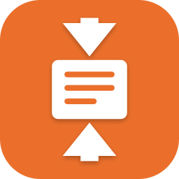
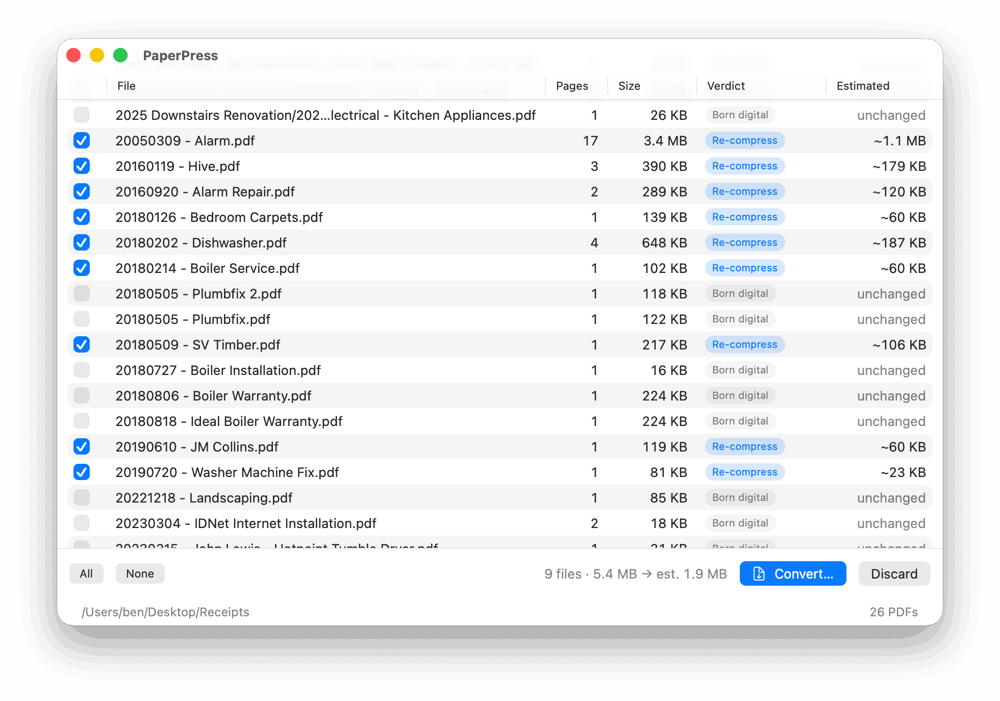
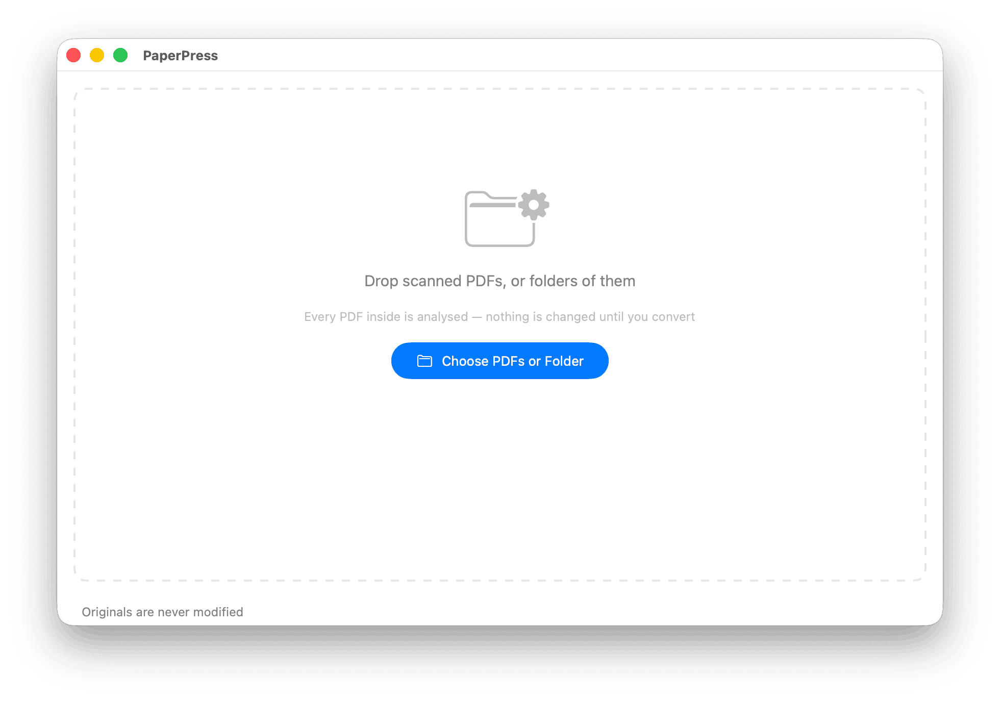
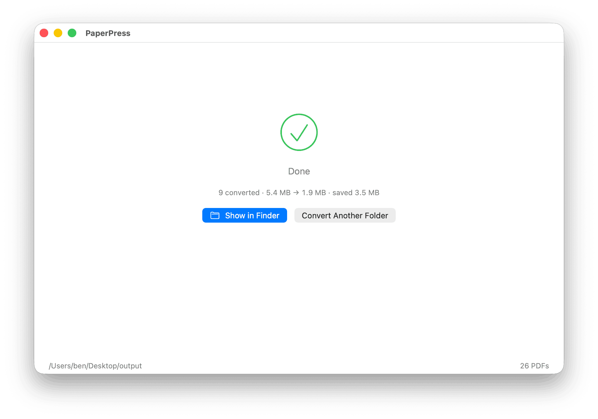

<div align="center">



# PaperPress

**Shrink a whole archive of scanned PDFs to tiny, searchable, 1-bit
black & white — without touching a single original.**

[](https://github.com/bensquire/PaperPress/actions/workflows/ci.yml)
[](https://github.com/bensquire/PaperPress/actions/workflows/release.yml)
[](https://github.com/bensquire/PaperPress/releases/latest)
[](https://www.apple.com/macos/)
[](https://swift.org)
[](LICENSE)

[**Download latest →**](https://github.com/bensquire/PaperPress/releases/latest) ·
[Releases](https://github.com/bensquire/PaperPress/releases)

<br/>



</div>

Drop a folder of scanned PDFs. PaperPress analyses every file —
recursively — and shows you exactly what it would do before it does
anything. Tick what you want, hit Convert, and a mirrored copy of the
folder appears with fat scans re-compressed to crisp 1-bit CCITT G4
(~20 KB per page) and everything else passed through byte-identical.
A 5.7 MB scan becomes ~300 KB; your originals are never modified.

PaperPress is the batch companion to
[PaperDrop](https://github.com/bensquire/PaperDrop), which makes these
compact PDFs at scan time.

## What it does

- **Analyse before convert** — every PDF gets a verdict up front:
  *Re-compress* (fat raster scans), *Born digital* (real text/vector
  PDFs that rasterising would only ruin), *Already 1-bit*, or *Already
  small*. Nothing is written until you confirm.
- **Tiny archival pages** — scan pages are re-rendered at 300 dpi
  (higher-res sources are downsampled; lower-res sources are upsampled
  so the antialiasing they carry becomes smooth 1-bit edges rather than
  jagged text), binarised with a locally adaptive threshold (Sauvola —
  faded print survives alongside bold print), despeckled, and stored
  with CCITT G4 fax compression: **~20 KB per A4 page**.
- **Photos survive** — pages that are actually photographic (histogram
  and local-contrast analysis, not guesswork) are kept as grayscale
  JPEG instead of being dithered to mush. One document can mix both.
- **Legibility beats compression** — sources scanned below 150 dpi
  never get binarised (small print can't survive it), and above that a
  worst-region damage check compares the 1-bit result against the
  grayscale it came from: if any region of the page degrades, the whole
  page stays grayscale — 4-bit Flate by default (crisper *and* smaller
  than JPEG on document content), or JPEG via Settings.
- **Searchable** — a fresh invisible text layer via Apple's Vision OCR
  on every converted page. No cloud, no external tools.
- **See it before and after** — analyse is instant and read-only;
  convert shows a live count and finishes with the space saved:

  <p align="center">
  
  
  </p>
- **Scan edges cleaned** — the black bands a scanner lid or skewed
  feed leaves along page edges are whitened (only when they hug the
  border — content that reaches the edge is kept; toggleable).
- **Never destructive** — output goes to a separate folder mirroring
  the source tree; pass-through files are copied byte-identical and
  file dates are preserved. If a conversion wouldn't save at least 20%
  (configurable), the original is copied instead.
- **Native and honest** — SwiftUI, signed and notarized, zero
  dependencies, no telemetry, entirely offline.

## Install

1. [Download the latest DMG](https://github.com/bensquire/PaperPress/releases/latest)
2. Drag **PaperPress** into **Applications**
3. Launch — no security warnings; the app is notarized by Apple

## Build from source

```sh
git clone https://github.com/bensquire/PaperPress.git
cd PaperPress
./bundle.sh        # builds + signs PaperPress.app (needs a Developer ID)
```

Or for development: `swift build && swift run PaperPress`.

## Development

```sh
make test     # unit tests (XCTest, AAA style)
make lint     # Apple swift-format, strict
make format   # auto-format in place
```

Enable the pre-commit hook (lint + tests) with:

```sh
git config core.hooksPath .githooks
```

### Project layout

```
Sources/PressKit/      # engine: inspection, classification, compression
  PDFInspector.swift   #   verdicts: scan / born-digital / already-1-bit
  PDFRender.swift      #   page rasteriser (native-dpi, rotation-aware)
  PageClassifier.swift #   text vs photo (paper-peak + smooth-midtone)
  Binarize.swift       #   Sauvola adaptive threshold + worst-region
                       #   damage metric (the G4-or-grayscale decision)
  EdgeClean.swift      #   scan-edge band removal (content-safe)
  Gray4.swift          #   4-bit grayscale Flate encoder (PNG predictor)
  Converter.swift      #   per-page G4/4-bit/JPEG ladder, min-saving guard
  Pipeline.swift       #   Otsu, cleanup, 1-bit packing (from PaperDrop)
  PDFWriter.swift      #   hand-rolled PDF: G4 + DCT + Flate + OCR layer
  G4.swift, OCR.swift  #   G4 stream extraction, Vision OCR
Sources/PaperPress/    # SwiftUI app: analyse → review → convert
Tests/PressKitTests/   # unit tests with programmatic PDF fixtures
icon/                  # programmatic icon generator
scripts/               # DMG packaging
```

## How a 5 MB scan becomes 20 KB per page

1. The page's embedded scan image is found and its true resolution
   measured; black scan-edge bands are whitened (content that reaches
   the edge is kept).
2. A histogram + spatial pass decides: document or photo?
3. Documents scanned at 150 dpi or better are re-rendered at 300 dpi
   (low-res antialiasing becomes smooth 1-bit edges), binarised with a
   locally adaptive threshold (Sauvola — faint print survives because
   each pixel is judged against its neighbourhood, not one global cut),
   despeckled, and G4-compressed — the encoding fax machines used,
   unbeatable for black-and-white text.
4. The 1-bit result is then compared region-by-region against the
   grayscale it came from; if the worst region measurably degraded
   (merged strokes, filled counters), or the source was below 150 dpi
   to begin with, the page ships as 4-bit grayscale Flate instead —
   legibility beats compression.
5. Photos: grayscale JPEG at 150 dpi — continuous tone carries no
   useful detail beyond that.
6. Vision OCR reads a 150 dpi grayscale of the page (measured as
   accurate as higher resolutions, much faster) and an invisible text
   layer is embedded, so Spotlight and Preview can search the result.
7. If the rebuilt PDF isn't meaningfully smaller, the original is
   copied through unchanged — the tool never makes a file worse.

## Releasing

Push a `v*` tag. CI builds, signs, notarizes, and staples the DMG,
then publishes a GitHub Release with generated notes:

```sh
git tag v0.1.0 && git push --tags
```

## License

[MIT](LICENSE)
