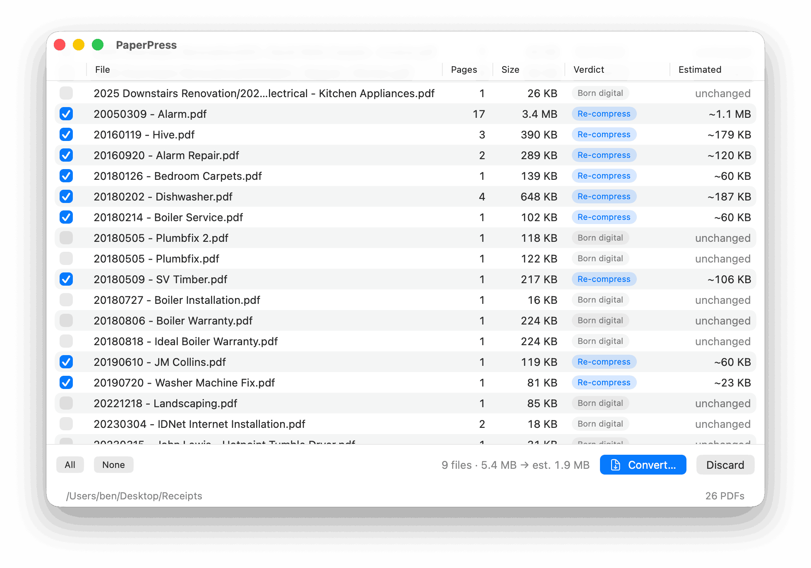
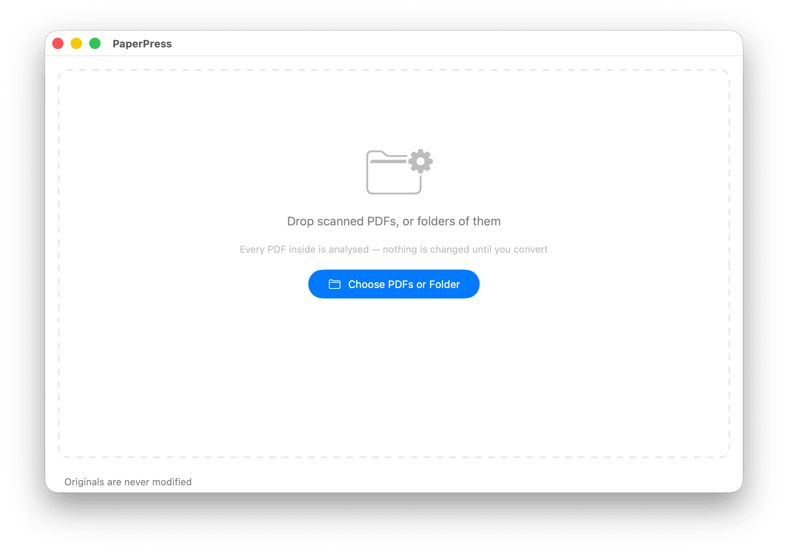
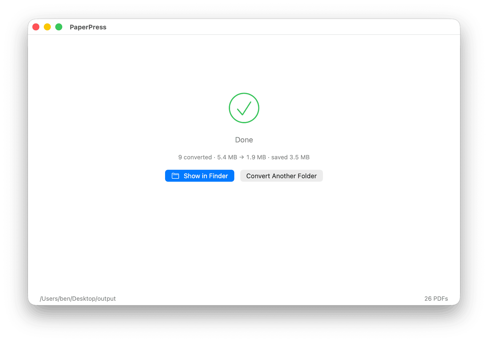

<div align="center">


# PaperPress

**Shrink a whole archive of scanned PDFs to tiny, searchable, 1-bit
black & white — without touching a single original.**

[](https://github.com/bensquire/PaperPress/actions/workflows/ci.yml)
[](https://github.com/bensquire/PaperPress/actions/workflows/release.yml)
[](https://github.com/bensquire/PaperPress/releases/latest)
[](https://www.apple.com/macos/)
[](https://swift.org)
[](LICENSE)

[**Download latest →**](https://github.com/bensquire/PaperPress/releases/latest) ·
[Releases](https://github.com/bensquire/PaperPress/releases)

<br/>



</div>

Drop a folder of scanned PDFs. PaperPress analyses every file —
recursively — and shows you exactly what it would do before it does
anything. Tick what you want, hit Convert, and a mirrored copy of the
folder appears with fat scans re-compressed to crisp 1-bit CCITT G4
(~20 KB per page) and everything else passed through byte-identical.
A 5.7 MB scan becomes ~300 KB; your originals are never modified.

PaperPress is the batch companion to
[PaperDrop](https://github.com/bensquire/PaperDrop), which makes these
compact PDFs at scan time.

## What it does

- **Analyse before convert** — every PDF gets a verdict up front:
  *Re-compress* (fat raster scans), *Born digital* (real text/vector
  PDFs that rasterising would only ruin), *Already converted*, *Already
  compact* (1-bit or 4-bit), or *Already small*. Nothing is written
  until you confirm.
- **Idempotent** — every output is stamped (PDF Producer metadata), so
  re-analysing a converted folder marks everything *Already converted*
  and nothing is ever re-encoded generation over generation.
- **Tiny archival pages** — scan pages are re-rendered at 300 dpi
  (higher-res sources are downsampled; lower-res sources are upsampled
  so the antialiasing they carry becomes smooth 1-bit edges rather than
  jagged text), binarised with a locally adaptive threshold (Sauvola —
  faded print survives alongside bold print), despeckled, and stored
  with CCITT G4 fax compression: **~20 KB per A4 page**.
- **Photos survive** — pages that are actually photographic (histogram
  and local-contrast analysis, not guesswork) are kept as grayscale
  JPEG instead of being dithered to mush. One document can mix both.
- **Real pages stay real** — in a file that mixes scans with
  born-digital pages (a typed cover sheet, say), the born-digital
  pages are carried over object for object: their text, fonts and
  vector art are never rasterised. Rotated and cropped scans come out
  as a viewer shows them.
- **Legibility beats compression** — sources scanned below 150 dpi
  never get binarised (small print can't survive it), and above that a
  worst-region damage check compares the 1-bit result against the
  grayscale it came from: if any region of the page degrades, the whole
  page stays grayscale, at full resolution, with its paper whitened and
  its ink set black — 4-bit Flate by default (crisper *and* smaller
  than JPEG on document content), or JPEG via Settings.
- **Searchable** — a fresh invisible text layer via Apple's Vision OCR
  on every converted page. No cloud, no external tools.
- **A queue** — Convert hands the reviewed batch to a queue in the
  right-hand column and frees the window for the next folder. Batches convert one
  at a time (OCR can't run two pages at once anyway), each with its own
  progress, results and Cancel; Pause lines several up before any
  starts.
- **See it before and after** — analyse is instant and read-only;
  each batch shows a live count and finishes with per-file results.
  Press space to Quick Look any file — sources on the review list,
  converted outputs on the results — and arrow through the batch:

  <p align="center">
  
  
  </p>
- **Scan edges cleaned** — the black bands a scanner lid or skewed
  feed leaves along page edges are whitened (only when they hug the
  border — content that reaches the edge is kept; toggleable).
- **A proper Finder citizen** — right-click → Open With → PaperPress on
  PDFs or folders (Preview stays your default), drop them on the Dock
  icon, or use "Analyse with PaperPress" in the Services menu; files
  arriving while a review is open join the current batch.
- **Never destructive** — output goes to a separate folder mirroring
  the source tree; pass-through files are copied byte-identical and
  file dates are preserved. An output folder that would put any file
  on top of an original is refused, and a file already in the output
  folder is only ever replaced if PaperPress wrote it. If a conversion
  wouldn't save at least 20% (configurable), the original is copied
  instead.
- **Native and honest** — SwiftUI, signed and notarized, zero
  dependencies, no telemetry, entirely offline.

## Using it from an AI assistant

Claude, Cursor, VS Code, Zed, Codex, Gemini CLI and other tools that speak
the Model Context Protocol (MCP) can analyse PDFs, preview a converted
page, and hand batches to PaperPress's queue, where you can watch and
cancel them.

First, in PaperPress, open Settings (⌘,) › Assistants and turn on **Allow
AI assistants to convert with PaperPress**. It is off until you do. Turn
on **Ask before converting a batch from an assistant** too if you want
each batch to wait in the queue for your approval, with its files
listed so you can untick any.

Then tell your assistant where PaperPress's MCP server is: a small
program inside the app, run with no arguments. Settings shows the exact
path for your copy, with Copy buttons.

**Claude Code**, for every project:

```
claude mcp add --scope user paperpress -- /Applications/PaperPress.app/Contents/MacOS/paperpress-mcp
```

**Claude Desktop, Cursor and most others** take the same entry in their
MCP configuration file:

```json
{
  "mcpServers": {
    "paperpress": {
      "command": "/Applications/PaperPress.app/Contents/MacOS/paperpress-mcp"
    }
  }
}
```

Then ask, for example: "Which of the PDFs in ~/Documents/Scans are worth
compressing? Preview a page of the biggest, then convert the lot into
~/Documents/Scans-small." Use full paths.

The assistant gets seven tools:

- **analyse** — every PDF's verdict, pages, size and estimated converted
  size. Read-only, and works with PaperPress closed.
- **preview** — one page converted exactly as convert would, as a
  picture, with how it was encoded and its size; `region` zooms into
  small print. Read-only, and works with PaperPress closed.
- **convert** — queues a batch into an output folder, opening PaperPress
  if needed. It answers with the results, or after 45 seconds with the
  job's id while the batch carries on; the same output-folder and
  never-overwrite rules apply as in the window.
- **wait**, **job_status**, **jobs** and **cancel** follow and manage
  the queue.

After updating PaperPress, restart the server in your assistant (in
Claude Code, `/mcp`; in Claude Desktop, quit and reopen it). A helper
older than the app replaces itself with the app's own where it can, and
otherwise says which side is older.

## Install

1. [Download the latest DMG](https://github.com/bensquire/PaperPress/releases/latest)
2. Drag **PaperPress** into **Applications**
3. Launch — no security warnings; the app is notarized by Apple

## Build from source

```sh
git clone https://github.com/bensquire/PaperPress.git
cd PaperPress
./bundle.sh        # builds + signs PaperPress.app (needs a Developer ID)
```

Or for development: `swift build && swift run PaperPress`. Needs macOS 26
and Xcode 26 (Swift 6.2).

## Development

```sh
make test     # unit tests (XCTest, AAA style), release build
make lint     # Apple swift-format, strict
make format   # auto-format in place
```

Enable the pre-commit hook (lint + tests) with:

```sh
git config core.hooksPath .githooks
```

### Project layout

```
Sources/PressKit/      # engine: inspection, classification, compression
  PDFInspector.swift   #   verdicts: convert / born-digital / already-*
  PDFRender.swift      #   page rasteriser (crop- and rotation-aware)
  PageClassifier.swift #   text vs photo (paper-peak + smooth-midtone)
  Binarize.swift       #   Sauvola adaptive threshold + worst-region
                       #   damage metric (the G4-or-grayscale decision)
  EdgeClean.swift      #   scan-edge band removal (content-safe)
  Gray4.swift          #   4-bit grayscale Flate encoder (PNG predictor)
  Converter.swift      #   per-page G4/4-bit/JPEG ladder, min-saving guard
  OutputPlan.swift     #   output paths; refuses folders that hit originals
  Pipeline.swift       #   Otsu, cleanup, 1-bit packing (from PaperDrop)
  Despeckle.swift      #   dust removal without a page-sized label map
  PDFWriter.swift      #   hand-rolled PDF: G4 + DCT + Flate + OCR layer
  CopiedPage.swift     #   born-digital pages lifted out object for object
  Deflate.swift        #   zlib level 9 for Flate streams
  G4.swift, OCR.swift  #   G4 stream extraction, Vision OCR
Sources/PressJobs/     # job vocabulary + the socket shared by app and helper
Sources/PressMCP/      # MCP server (by hand, from Prospect) and the tools
Sources/paperpress-mcp/ # the helper an assistant launches
Sources/PressApp/      # SwiftUI app: analyse → review → queue
Sources/PaperPress/    # @main entry point
Tests/PaperPressTests/ # unit tests with programmatic PDF fixtures
icon/                  # programmatic icon generator
scripts/               # DMG packaging
```

## How a 5 MB scan becomes 20 KB per page

1. The page's embedded scan image is found and its true resolution
   measured; black scan-edge bands are whitened (content that reaches
   the edge is kept).
2. A histogram + spatial pass decides: document or photo?
3. Documents scanned at 150 dpi or better are re-rendered at 300 dpi
   (low-res antialiasing becomes smooth 1-bit edges), binarised with a
   locally adaptive threshold (Sauvola — faint print survives because
   each pixel is judged against its neighbourhood, not one global cut),
   despeckled, and G4-compressed — the encoding fax machines used,
   unbeatable for black-and-white text.
4. The 1-bit result is then compared region-by-region against the
   grayscale it came from; if the worst region measurably degraded
   (merged strokes, filled counters), or the source was below 150 dpi
   to begin with, the page ships as 4-bit grayscale Flate instead, at
   the text resolution (capped at the source's own), with paper levelled
   to white — legibility beats compression.
5. Photos: grayscale JPEG at 200 dpi — continuous tone carries little
   useful detail beyond that.
6. Vision OCR reads a 150 dpi grayscale of the page (measured as
   accurate as higher resolutions, much faster) and an invisible text
   layer is embedded, so Spotlight and Preview can search the result.
7. If the rebuilt PDF isn't meaningfully smaller, the original is
   copied through unchanged — the tool never makes a file worse.

## Releasing

Releases are cut by tag. Pushing a `v*` tag makes CI build, sign,
notarize, and staple the DMG, then publish a GitHub Release with
generated notes:

```sh
git tag v0.1.0
git push --tags
```

The release workflow needs six repository secrets (Settings → Secrets
and variables → Actions) for signing and notarization:
`SIGNING_CERTIFICATE_P12_BASE64`, `SIGNING_CERTIFICATE_PASSWORD`,
`APPLE_TEAM_ID`, `APPLE_API_KEY_BASE64`, `APPLE_API_KEY_ID`,
`APPLE_API_ISSUER_ID`. A `vX.Y.Z-something` tag (e.g. `v0.2.0-rc1`)
publishes as a prerelease. Plain pushes only run lint/tests/smoke —
tags are the only way a release ships.

## License

[MIT](LICENSE)
